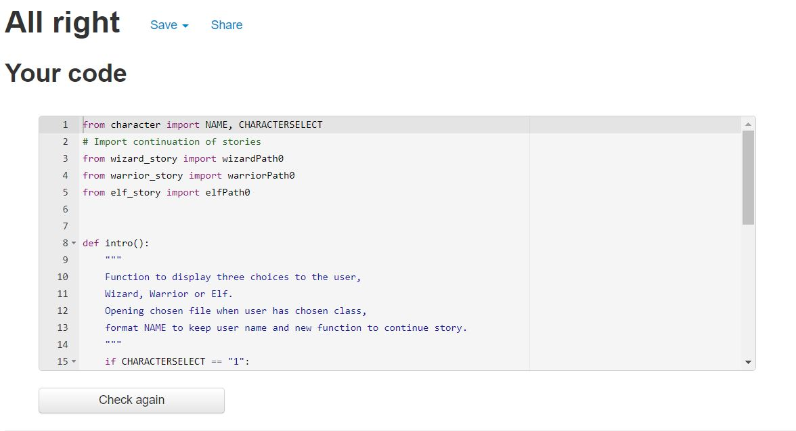
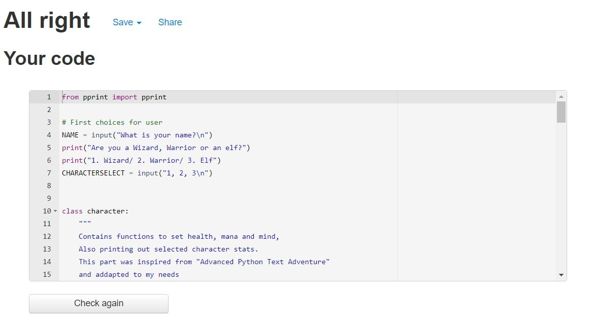
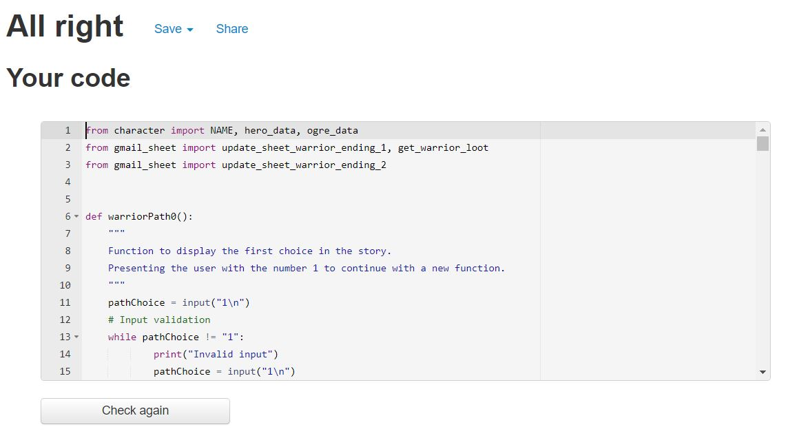
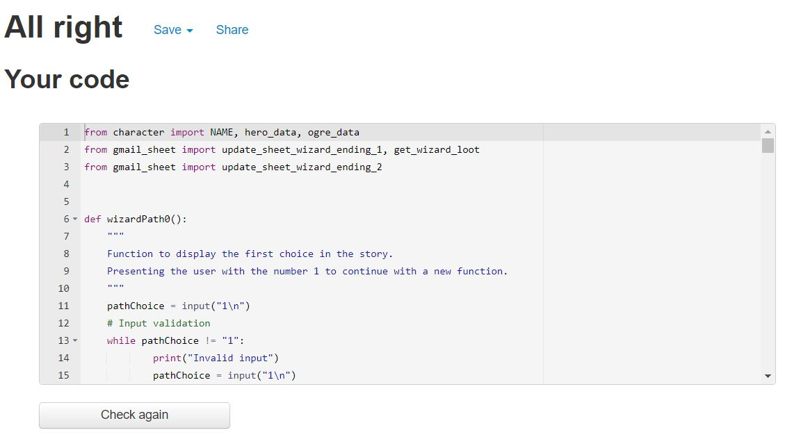
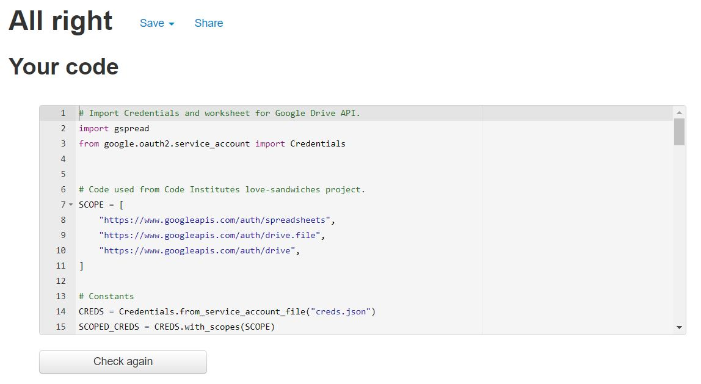

# Story Game

## Welcome to my program [Story Game](https://ci-pp3-story.herokuapp.com/)!

 

<!-- markdown-toc start - Don't edit this section. Run M-x markdown-toc-
refresh-toc -->

# Table of Content

1. [Project goals](#project-goals)

2. [User experience](#user-experience)

    1. [Target audience](#target-audience)

    2. [User stories](#user-stories)

    3. [Technical design](#technical-design)

3. [Features](#features)

4. [Technologies used](#technologies-used)

    1. [Languages](#languages)

    2. [Libraries and programs](#libraries-and-programs)

5. [Testing](#testing)

    1. [Python](#python)

    2. [Further testing](#further-testing)

    3. [Testing user stories](#testing-user-stories)

6. [Bugs](#bugs)

7. [Deployment](#deployment)

8. [Credit](#credit)

    1. [Acknowledgement](#acknowledgement)

## Project goals

* I want to create a challenging game where a user can pick multiple classes and have multiple path choices. 

## User experience

### Target audience

* Anyone who wants to play a fun and challenging game.

### User stories

1. As a user I want an original story.

2. As a user I want to be challenged when playing the game.

3. As a user I want to be able to write my name in to the story.

4. As a user I want to be able to choose multiple paths.

5. As a user I want to be able to chose multiple classes.

6. As a user I want to be able to see my stats.

#### Site owner goals

7. As a site owner I want the user to be challenged.

8. As a site owner I want the user to experience an original story. 

9. As a site owner I want the user to have multiple path options.

10. As a site owner I want to be able to see how many has finished the story in either path.

11. As a site owner I want to have a loot system for the user.

### Technical design

* Below you can see the images of the flowchart.

Flowchart

## Features

* **Naming your character**

* The first option the user will have is to name their character what they want.
 

### User stories covered by this feature:

* 3. As a user I want to be able to write my name in to the story.

* **Class choice**

* The second option the user will have is to choose one of three different classes.
 

### User stories covered by this feature:

* 5. As a user I want to be able to chose multiple classes.

* **Stats**

* A feature has been added to show the stats of the chosen class and to show clothes of the class.
 

### User stories covered by this feature:

* 6. As a user I want to be able to see my stats.

* **Path Choices**

* A big feature is the game has alot of different paths the user can take throughout the game.
 

### User stories covered by this feature:

* 1. As a user I want an original story.

* 2. As a user I want to be challenged when playing the game.

* 4. As a user I want to be able to choose multiple paths.

* 7. As a site owner I want the user to be challenged.

* 8. As a site owner I want the user to experience an original story. 

* 9. As a site owner I want the user to have multiple path options.

* **Health and mana**

* During the battle with the ogre a feature has been added to show health and mana drained.
 

### User stories covered by this feature:

* 6. As a user I want to be able to see my stats.

* **Loot**

* After the battle with the ogre a feature has been added to drop loot.
 

### User stories covered by this feature:

* 11. As a site owner I want to have a loot system for the user.

* **Endings**

* For every class there are two different endings.
 

### User stories covered by this feature:

* 1. As a user I want an original story.

* 4. As a user I want to be able to choose multiple paths.

* 8. As a site owner I want the user to experience an original story. 

* 9. As a site owner I want the user to have multiple path options.

* **Google Sheet**

* When a user finishes one of the six different endings, a spreadsheet is updated to have a statistic of how many people have finished the different stories.
 

### User stories covered by this feature:

* 10. As a site owner I want to be able to see how many has finished the story in either path.

### Features left to implement

* I want to implement a feature where the story text has a time delay so all of the text does not come at the same time.

## Technologies used

### Languages

* Python

## Libraries and programs

* diagrams.net for creating flow chart.

* Github

* Gitpod

* VS code

* Google Sheets

## Testing

### Validator testing

#### Python

No errors were found on run.py when passing through PEP8 Validator.

No errors were found on character.py when passing through PEP8 Validator.

No errors were found on elf_story.py when passing through PEP8 Validator.

No errors were found on warrior_story.py when passing through PEP8 Validator.

No errors were found on wizard_story.py when passing through PEP8 Validator.

No errors were found on gmail_sheet.py when passing through PEP8 Validator.

## Further testing

## Testing user stories

1. As a user I want an original story.

|             Feature           |        Action        |                 Expected result                    |   Actual result     |
|            :----------:       |    :------------:    |               :-----------------:                  | :---------------:   |
|  The story has been written by the site owner |    None    |       Original story                         |  Original story     |
|   Different paths changes the story   |    Choose path     |   Story will change with different paths     |   Works as expected |

Screenshot

2. As a user I want to be challenged when playing the game.

|             Feature           |        Action        |                 Expected result                    |   Actual result     |
|            :----------:       |    :------------:    |               :-----------------:                  | :---------------:   |
|  Different paths ends the game  |    Choose path     |      If the user picks a wrong path the game ends  | Works as expected   |

Screenshot

3. As a user I want to be able to write my name in to the story.

|             Feature           |        Action        |                 Expected result                    |   Actual result     |
|            :----------:       |    :------------:    |               :-----------------:                  | :---------------:   |
|  Write your name and it stays in the story  |  Write you name | After user writes name it will show up in the story | Works as expected   |

Screenshot

4. As a user I want to be able to choose multiple paths.

|             Feature           |        Action        |                 Expected result                    |   Actual result     |
|            :----------:       |    :------------:    |               :-----------------:                  | :---------------:   |
|  Different paths in the story   |  Choose path       |      Different story depending on choice           |   Works as expected |

Screenshot

5. As a user I want to be able to chose multiple classes.

|             Feature           |        Action        |                 Expected result                    |   Actual result     |
|            :----------:       |    :------------:    |               :-----------------:                  | :---------------:   |
|   Choosing a class            |  Choose class        |   A user will be able to choose different classes  | Works as expected   |

Screenshot

6. As a user I want to be able to see my stats.

|             Feature           |        Action        |                 Expected result                    |   Actual result     |
|            :----------:       |    :------------:    |               :-----------------:                  | :---------------:   |
|   Display stats               |   Pick a class       |  When picking a class the stats will be displayed  |  Works as expected  |

Screenshot

7. As a site owner I want the user to be challenged.

|             Feature           |        Action        |                 Expected result                    |   Actual result     |
|            :----------:       |    :------------:    |               :-----------------:                  | :---------------:   |
|  Different paths ends the game  |    Choose path     |      If the user picks a wrong path the game ends  | Works as expected   |

Screenshot

8. As a site owner I want the user to experience an original story. 

|             Feature           |        Action        |                 Expected result                    |   Actual result     |
|            :----------:       |    :------------:    |               :-----------------:                  | :---------------:   |
|  The story has been written by the site owner |    None    |       Original story                         |  Original story     |
|   Different paths changes the story   |    Choose path     |   Story will change with different paths     |   Works as expected |

Screenshot

9. As a site owner I want the user to have multiple path options.

|             Feature           |        Action        |                 Expected result                    |   Actual result     |
|            :----------:       |    :------------:    |               :-----------------:                  | :---------------:   |
|  Different paths in the story   |  Choose path       |      Different story depending on choice           |   Works as expected |

Screenshot

10. As a site owner I want to be able to see how many has finished the story in either path.

|             Feature           |        Action        |                 Expected result                    |   Actual result     |
|            :----------:       |    :------------:    |               :-----------------:                  | :---------------:   |
| When a user finishes a story, data is sent to a sheet  |   Finish the game |  Sheet will be updated       | Works as expected   |

Screenshot

11. As a site owner I want to have a loot system for the user.

|             Feature           |        Action        |                 Expected result                    |   Actual result     |
|            :----------:       |    :------------:    |               :-----------------:                  | :---------------:   |
|  Defeating the ogre generates loot  |   Defeating the ogre |    when defeating the ogre loot should be presented |  Works as expected |

Screenshot

### API

* Google Sheets

    1. Go to Google Spreadsheet and create a new sheet.

    2. Go to Google Cloud Platform.

    3. Click **select a project** in the top left corner and then **new project** in the pop up window, top left corner.

    4. Give the project a name and click create, then click **select project**

    5. Click the **navigation** button in the top left corner and select **API's & Services**.

    6. Search for **google drive** and click on it and then enable and click **create credentials**.

    7. Choose **google drive api** in the drop down menu, then **application data** and then select **No, I'm not using them.** and then **next**

    8. Fill out your service account name, then **continue**, select **editor** in role field and continue, then **done**.

    9. Go to the **credentials** page under **API's & Services**, fill out the button next to the email at the bottom of the screen and click **service account details**.

    10. Go to **keys** click **add key** then **create new key**, fill out **json** and create.

    11. Now you should have a downloaded file with your key, drag this file to your workspace and rename it to **creds.json**.

    12. Copy **client-email** from **creds.json**, go to the spredsheet and click the **share** button. Paste the client email, make sure editor is selected, remove notify people and then click share.

    13. In your workspace find the file **.gitignore**, open it and add **creds.json**.

    14. Go to **API's & Services** and search for **google sheets**, select it and then click **enable**.

## Bugs

* **Bug:** When opening txt files with story, the name would not print out how it had been input in the beginning.

    * **Fix:** When printing the text from the file I added .format(NAME) to format the variable. In the txt files I added {0} where I wanted the name to access the NAME variable.

* **Bug:** In some places the print statements and the docstrings were to long. 

    * **Fix:** I took some of that text and added it on another line.

* **Bug:** In some places the name, hero_data or ogre_data was not printing.

    * **Fix:** I added the missing f in the print statement.

* **Bug:** When getting data from google sheets it did not work to get the value.

    * **Fix:** I added int before to change the value.

* **Bug:** The validate input code did not work with my class_story.py.

    * **Fix:** To fix it I instead used a while loop to check if the input *is not equal to* my value print invalid input.

### Known bugs

## Deployment

### Deploying to Heroku

1. Use **pip3 freeze > requirements.txt** in terminal to save libraries that needs to be installed on Heroku as well.

2. Log in to Heroku.

3. Click on the **new** button in the top right corner and in the drop down menu choose **Create new app**.

4. Choose a name for the app and a region and click **Create app**.

5. Go to the **settings** tab and go to **Config Vars**, click **Reveal Config Vars** and add **CREDS** to the key field. Add creds.json content to the value field.

6. In the **settings** tab add the python build pack first and then the node.js build pack.

7. Go to the **deploy** tab and pick **GitHub** as deployment method.

8. Search for a repository and connect to it.

9. Click the button **enable automatic deploys** and then the button **deploy branch**.

10. Wait for the app to build and then click the **view** button.

### Forking a repository

1. Log in to Github.
2. Find the repository.
3. In the top right corner click the fork button.
4. Now you will have a copy of the repository in your account.

### Cloning a repository
1. Log in to Github.
2. Find the repository.
3. Above the file window locate the green code button and click it.
4. To clone the repository using https copy the link.
5. Open Git bash.
6. Change the current directory to where you want the repository cloned.
7. In your terminal type now type “Git clone” followed by the repository you copied.
8. Press Enter.
9. Done.

## Credit

### For setting up Google sheets some code was used from Code Institutes learning project, "Love Sandwiches".

### I mainly watched these videos to get inspiration for my own project

* Some code was used and addapted from this video [Advanced Python Text Adventure](https://www.youtube.com/watch?v=VxhZZHnig8U)

* [Making an Adventure Game in Python](https://www.youtube.com/watch?v=EbAdsK8s0-U&t=462s)

* [Python Programming](https://www.youtube.com/watch?v=NK_uQaC89vo&t=1134s)

* [Simple Python Project](https://www.youtube.com/watch?v=ypNFNr72Xe8&t=2342s)

* [Choose Your Own Adventure Game in Python](https://www.youtube.com/watch?v=DEcFCn2ubSg&t=559s)

* [Writing a Text-Based Adventure Game in Python](https://www.youtube.com/watch?v=miuHrP2O7Jw&t=1322s)

## Acknowledgement

* My Mentor Mo has been invaluable, he pushed me to challenge myself and he was able to provide consistent and helpful feedback throughout my project.
